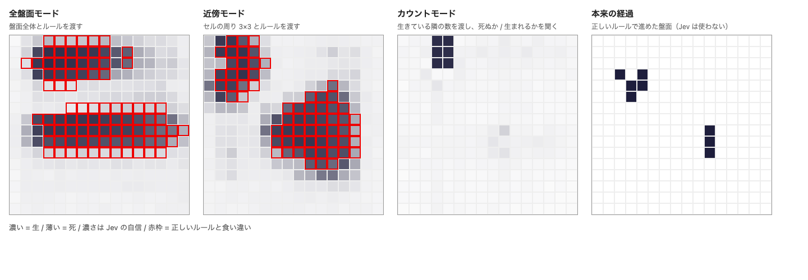
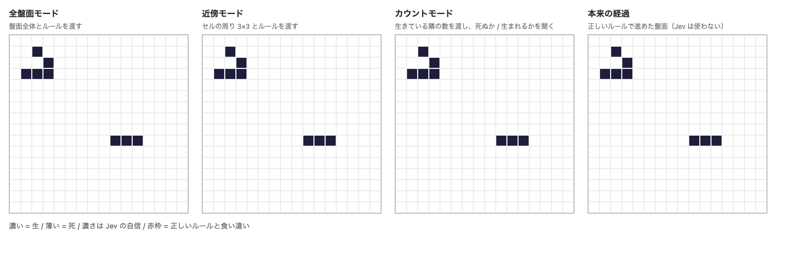
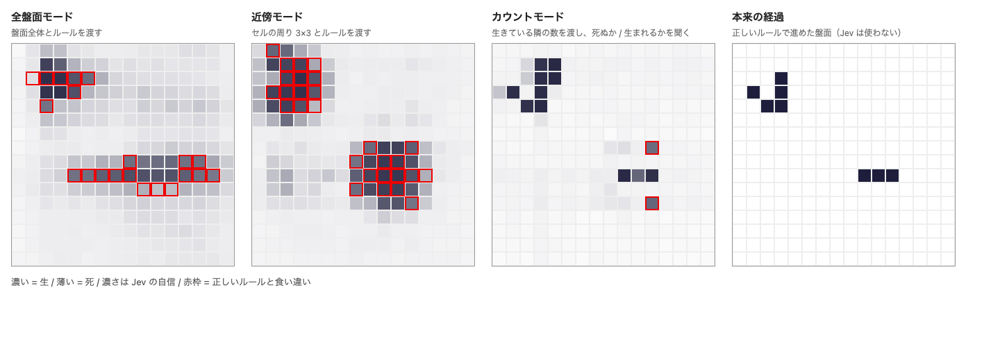

# Jev ライフゲーム

Jev（TypeSafe の System One モデル `jev-1.13.0`）に、ライフゲームの各セルが次の世代で生きているかを判定させ、世代を進めるデモです。

同じ初期盤面から、Jev への材料の渡し方が違う3つの盤面を進めます。正しいルールだけで進めた「本来の経過」も横に並べます。Jev の誤りは直さずに次の世代へ持ち越すので、誤りがどう積み重なるかを眺められます。



## 3つのモード

| 盤面 | Jev に渡すもの | 聞くこと |
|---|---|---|
| 全盤面モード | 盤面全体とルール | このセルは次の世代で生きているか |
| 近傍モード | セルの周り 3×3 とルール | 中央のセルは次の世代で生きているか |
| カウントモード | 生きている隣の数（コードで数える） | 生きているセルには「死ぬか」、死んでいるセルには「生まれるか」 |
| 本来の経過 | （Jev は使わない） | 正しいルールで進めた盤面 |

盤面の見方は次のとおりです。

- セルの濃さは、Jev が「生きている」と答えた確率を表します。
- 赤枠は、その世代で正しいルールを当てはめた結果と食い違ったセルです。
- セルにカーソルを載せると、確率と正解が出ます。

## Jev へのプロンプト

プロンプトは `src/jev.js` で組み立てています。1世代ごとに、モードごとに1リクエストを送ります。1リクエストの中身は、共通の state と、セルごとの質問 256 問です。質問の名前は `c<行>_<列>` で、型はどれも Noul（「はい」である確率を返す問い）です。

### ルール文

全盤面モードと近傍モードでは、state の `rules` に次の文を入れます（`rules(torus, n)`）。

```
Conway's Game of Life. '#' is a live cell, '.' is a dead cell. <端の扱いの1文>
A live cell with 2 or 3 live neighbours stays alive; a dead cell with exactly 3 live neighbours becomes alive;
every other cell is dead in the next generation. Neighbours are the 8 surrounding cells.
```

端の扱いの1文は、次のどちらかです。

- 外側は死: `Cells outside the board are dead.`
- トーラス: 上下の端と左右の端がつながっていることを書き、「0 行目の上は 15 行目、0 列目の左は 15 列目」と具体的に添えた文

### モードごとの state と質問

3つのモードは、Jev に任せる仕事を段階的に減らしていく並びです。どこまで減らせば Jev が正しく判定できるかを、盤面を並べて見比べます。

| モード | state | セル (r, c) への質問 | Jev に任せる仕事 |
|---|---|---|---|
| 全盤面 | `rules` と 16 行の `board` | ``Look at `board` (row r, column c, both 0-indexed; the character `board[r][c]`). Is this cell alive in the next generation?`` | 座標でセルを探す、隣を数える、ルールを当てはめる |
| 近傍 | `rules` と、セルごとの 3×3 の窓 `neighborhoods["r,c"]` | ``… is a 3x3 window; its centre character is the cell. Is the centre cell alive in the next generation?`` | 隣を数える、ルールを当てはめる（セルを探すのはコード） |
| カウント | 隣の数 `n["r,c"]` だけ（ルール文なし） | 生のセル: ``… A live cell survives only when it has 2 or 3 live neighbours. Does this cell die?``<br>死のセル: ``… A dead cell comes to life only when it has exactly 3 live neighbours. Does this cell come to life?`` | ルールを当てはめるだけ（数えるのはコード） |

### 書き方の意図

- **カウントモードでは、そのセルに関係するルールを1本だけ質問に書きます。** 生き残りと誕生のルールを1問に詰め込むと、Jev が誤りました。1問1ルールに分けると、プロトタイプの 8×8 では 64 セルすべて正解しました。
- **カウントモードの確率は変換します。** 生のセルには「死ぬか」を聞くので、生である確率は `1 − p` です。死のセルには「生まれるか」を聞くので、`p` をそのまま使います。どのモードでも、生である確率が 0.5 以上なら生とします。
- **全盤面モードのトーラス対応は、ルール文の1文を差し替えるだけです。** 盤面の渡し方は変えません。これで端の判定が崩れても、それもデモの見どころとして受け入れます。
- **近傍モードの窓とカウントモードの隣の数は、コードが端の扱いに従って作ります。**
- プロトタイプ（`prototype-jev-probe/`）で試したのは、「外側は死」の文を使ったルール文だけです。

プロンプトの全文と、決めた経緯は `docs/spec.md` の「4.3 モードごとの state と質問」にあります。

## 見え方の例

初期盤面は glider と blinker です（世代 0）。



世代 2 です。全盤面モードと近傍モードでは、すでにセルがにじみ始めています。カウントモードも、blinker の周りで2セル誤っています。



世代 5 です（冒頭の画像と同じ）。全盤面モードと近傍モードは、生きたセルのかたまりに崩れました。カウントモードは blinker を正しく回しています。一方、glider は誤りが積み重なって本来の経過から外れました。

Jev の答えは実行するたびに少しずつ変わるので、同じ初期盤面でも毎回同じ経過にはなりません。

## 動かし方

Node.js 20.19 以上（22 系なら 22.12 以上）と、TypeSafe の API キーが必要です。

```sh
npm install
npm run dev
```

表示された URL（既定は http://localhost:5173/）をブラウザで開きます。画面右上に API キーを入れて「保存」を押すと、「再生」と「1世代送り」が使えるようになります。

- キーはブラウザの localStorage に平文で保存されます。共用のブラウザでは、使い終わったら「消去」を押してください。
- `api.typesafe.ai` はブラウザからの直接の呼び出し（CORS）を受け付けないので、Vite の開発サーバが `/v1` を中継します。そのため `npm run dev` でしか動きません（build した静的ファイルでは API を呼べません）。
- 1世代につき3モード分、計3リクエストを送ります。16×16 の盤面では、1世代あたり約5万トークン（$0.002 程度）です。再生は 100 世代で自動的に止まります。

## 操作

- **再生 / 一時停止**: 世代を連続して進めます。間隔は1世代あたり最短1秒です。
- **1世代送り**: 1世代だけ進めます。
- **リセット**: 世代 0 に戻します。
- **初期盤面の選択**: glider + blinker・glider・R-pentomino・pulsar・LWSS から選びます。「ランダム」を押すと、ランダムな盤面になります。世代 0 のときは、セルをクリックして生死を反転できます。
- **端の扱い**: 「外側は死」（盤面の外はすべて死）と「トーラス」（上下の端と左右の端がそれぞれつながる）を切り替えます。4つの盤面にまとめて効き、再生中に切り替えたときは次の世代から効きます。

## テスト

```sh
npm test
```

盤面の計算（`src/life.js`）と、Jev へのリクエストの組み立て・エラー処理（`src/jev.js`）を検証します。API は呼びません。

## ファイル

| パス | 中身 |
|---|---|
| `index.html`, `src/main.js`, `src/style.css` | 画面と操作 |
| `src/life.js` | 盤面・端の扱い・正しいルールでの次世代・初期盤面のプリセット |
| `src/jev.js` | 3つのモードの state と質問の組み立て、API 呼び出しと再試行 |
| `docs/spec.md` | 仕様 |
| `CONTEXT.md` | 用語集 |
| `prototype-jev-probe/` | 仕様を決める前に、数セルで判定を試したプロトタイプ |

仕様の検討の経緯は、GitHub の issue「[Jev でライフゲームを回すデモの仕様](https://github.com/uehaj/jev-conway-lifegame/issues/1)」とその子 issue にあります。
